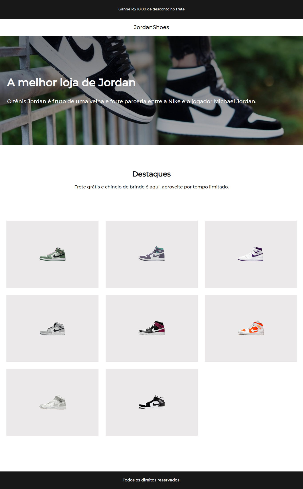

# Desafios-Codelandia

     <h2>Desafio 02 : projeto JordanShoes</h2>
     
     <h3>background-attachment: fixed; para fazer um efeito paralax na imagem
     </h3>
     <h3>
      grid-template-columns: repeat(auto-fit, 415px);
      para deixar os elementos responsivos sem precisar usar o media query
     </h3>
     <h3> display: flex; e o gap para usar nos textos </h3>

